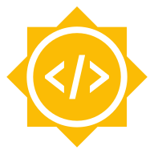

  

## Ιστοσελίδα

[https://summerofcode.withgoogle.com/](https://summerofcode.withgoogle.com/)

## Τι είναι το GSoC;

Το GSoC ξεκίνησε απευθυνόμενο σε φοιτητές. **Από το 2022 το πρόγραμμα είναι ανοικτό σε οποιονδήποτε είναι άνω των 18 ετών.**

Προσφέρει την ευκαιρία στους νέους να συμβάλουν σε ένα έργο ανοιχτού κώδικα και να μάθουν πώς είναι να εργάζονται σε περιβάλλον ανάπτυξης ανοιχτού λογισμικού.

Διεξάγεται κάθε καλοκαίρι και συμμετέχουν στο GSoC χιλιάδες φοιτητές από όλο τον κόσμο αποκομίζοντας σημαντικές εμπειρίες, συμβάλλοντας ταυτόχρονα στην ανάπτυξη δημοφιλών έργων ανοικτού λογισμικού.	
  
Προσφέρει χρηματικές απολαβές.

Η σκέψη ήταν να βοηθήσουν οικονομικά τους φοιτητές που γνωρίζουν/ενδιαφέρονται για προγραμματισμό ώστε να μην εργαστούν σε καλοκαιρινή δουλειά που θα είναι άσχετη με τον τομέα τους.

Παλιότερα η αμοιβή ήταν **5000$**. Πριν 2-3 χρόνια ήταν **2500$**.

Φέτος αναφέρει ότι προσαρμόζονται στο κόστος ζωής με βάση τη χώρα.

Ανεξαρτήτως με τα χρήματα, θα μετρήσει και στο βιογραφικό.  

## Πως μπορώ να συμμετέχω;

ΦΤΙΑΞΤΕ **GITHUB / GITLAB** ΑΝ ΔΕΝ ΞΕΡΕΤΕ ΠΩΣ, [ΔΕΙΤΕ ΤΗΝ ΠΑΡΟΥΣΙΑΣΗ](https://opensourceuom.gitlab.io/blog/posts/mathima-git).

* Αναζήτηση [οργανισμών στην σελίδα](https://summerofcode.withgoogle.com/programs/2022/organizations)  

* Σε κάθε οργανισμό περιγράφει με λίγα λόγια τον οργανισμό και αναφέρει τις τεχνολογίες των προς ανάληψη έργων. Παράδειγμα στο *GNOME* στις τεχνολογίες αναφέρει *c, linux, rust, gtk, Flatpak*.

Αν γνωρίζετε κάποια από αυτές, πατήστε το πλήκτρο **View Ideas List** για να δείτε τα έργα που προσφέρει.  

* Αφού βρείτε το έργο που σας αρέσει, τότε επικοινωνήστε με τον μέντορα.

* Σε κάποια έργα είναι καλό να κάνετε μια μικρή συνεισφορά για να σας γνωρίσουν καλύτερα. Αρκετές φορές αυτό γίνεται σε συνεργασία με τον μέντορα.  

* Σε συνεργασία με τον μέντορα θα καταστρώσετε το πρόγραμμα εργασίας και την αίτηση για υποβολή (ΠΡΟΣΟΧΗ: δεν θα τα γράψει αυτός για εσάς). Αναμονή για τα αποτελέσματα.

**ΣΗΜΕΙΩΣΗ**: Η διάρκεια που θα εργαστείτε ποικίλει ανάλογα με το project. Κυμαίνεται από 175 ώρες ως 350 ώρες.  

## TIPs

**TIP 1**: Αν δεν γνωρίζετε όλες τις γλώσσες / τεχνολογίες, μην απορρίπτετε τον οργανισμό. Μπορεί να έχει ένα έργο που να απαιτεί ΜΟΝΟ την γλώσσα / τεχνολογία που
γνωρίζετε.

**TIP 1.0**: Σε περίπτωση που γνωρίζετε ΜΟΝΟ μια από τις 2 απαιτούμενες γλώσσες / τεχνολογίες, αλλά σας αρέσει ο τίτλος του έργου, μην απορρίπτετε το έργο.
Επικοινωνήστε με τον μέντορα και συζητήστε το. Η λογική είναι να μάθετε μια νέα τεχνολογία το καλοκαίρι.

## Timeline

Βρίσκεται αναλυτικά στην σελίδα [https://developers.google.com/open-source/gsoc/timeline](https://developers.google.com/open-source/gsoc/timeline)

Σημαντικές ημερομηνίες:  
* **4 - 19 Απριλίου**: Υποβολή αιτήσεων  
* **20 Μαΐου**: Ανακοίνωση φοιτητών που έγιναν αποδεκτοί  
* **13 Ιουνίου - 12 Σεπτεμβρίου**: Διάρκεια προγράμματος  
* **20 Σεπτεμβρίου**: Ανακοίνωση αποτελεσμάτων  

## Αρχείο παρουσίασης

- [Ενημέρωση για το Google Summer of Code.pdf](../post_files/2022-03-13/Ενημέρωση_για_το_Google_Summer_of_Code.pdf)  

## Παραδείγματα οργανισμών

* **GNOME**: [https://gsoc.gnome.org/](https://gsoc.gnome.org/)  
* **openSUSE**:  [https://101.opensuse.org/](https://101.opensuse.org/)  
* **ΕΛΛΑΚ**: [GSoC 2022](https://ellak.gr/wiki/index.php?title=Google_Summer_of_Code_2022_proposed_ideas)  
